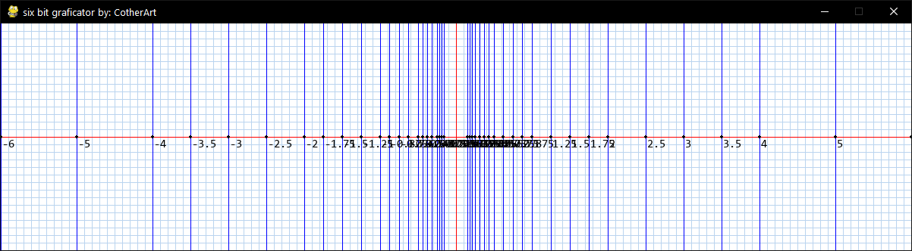

# Six bit graficator
Author: CotherArt

## Description
This program shows in a decimal base numeric line, all the numbers that a imaginary base 6 bit computer can store.

## Setup
```
pip install pygame
```

## Usage
This are the various commands you can use directly on the creen:
```
zoom 1
zoom 2
zoom 3
zoom 4
```

## Screenshots
### Zoom 2

### Zoom 3
